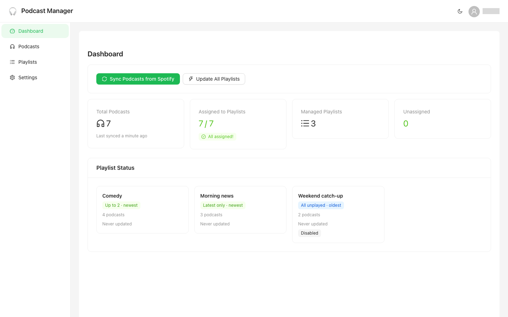
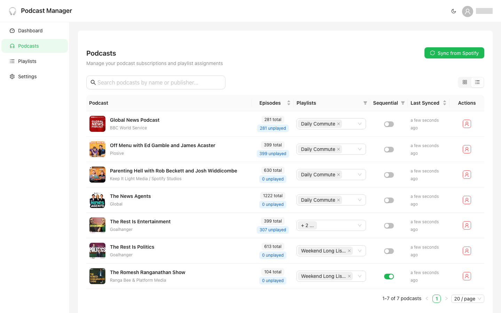
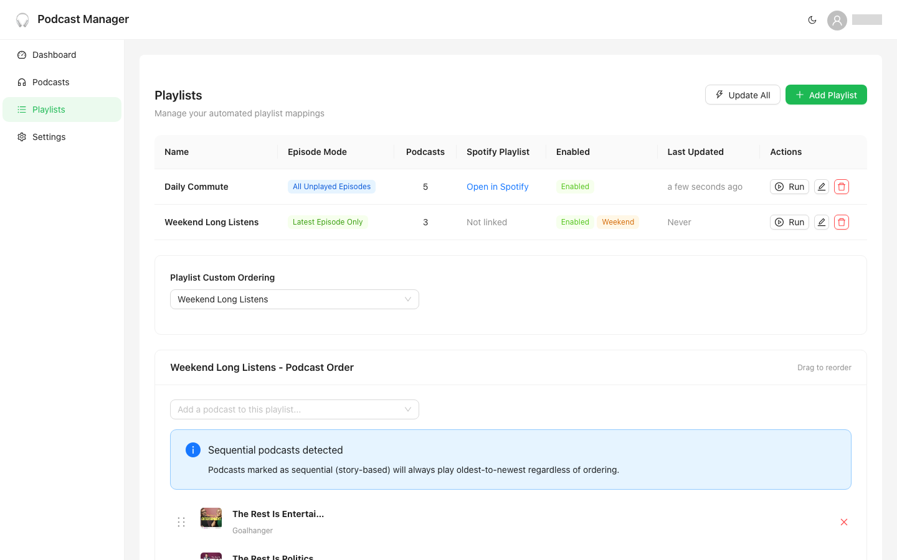
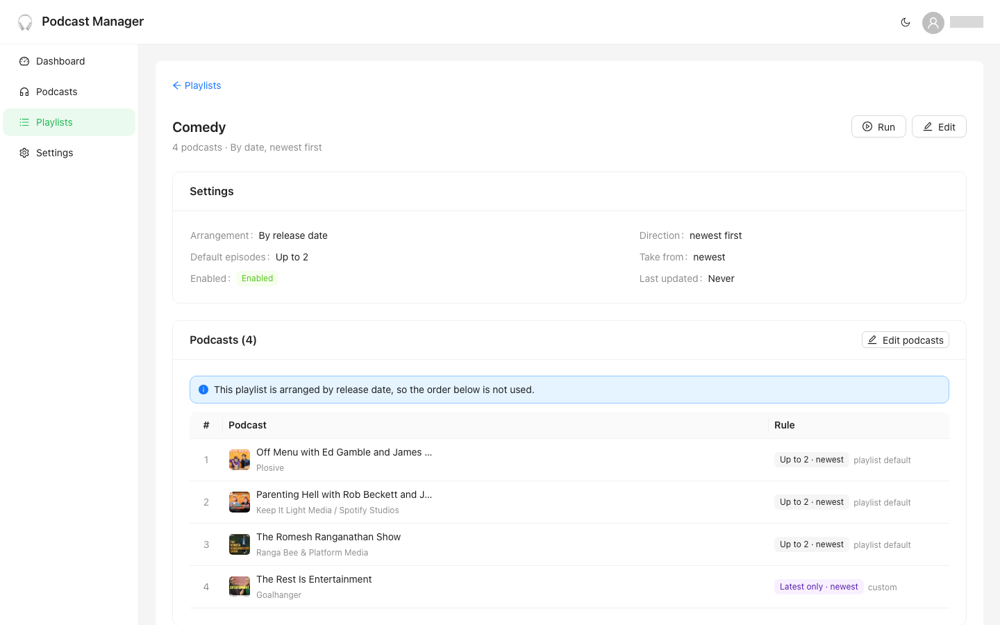
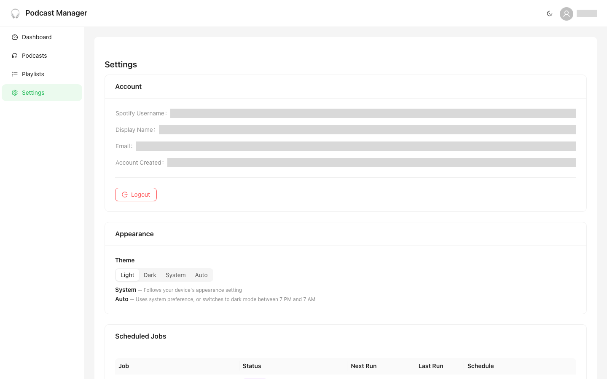
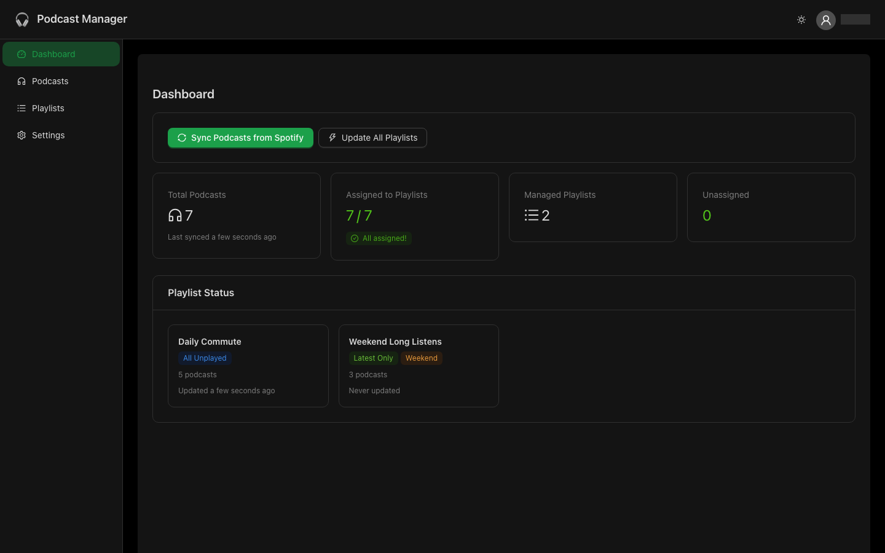
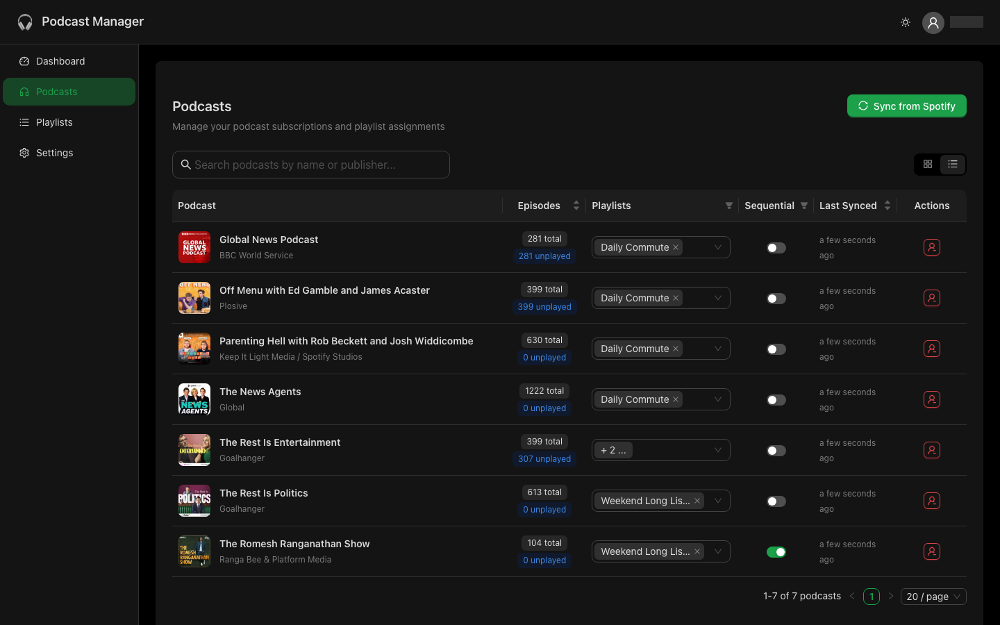
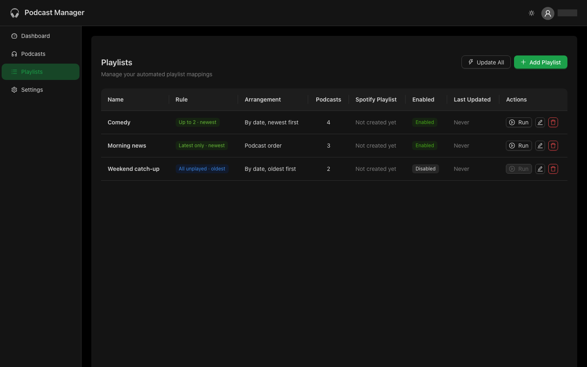
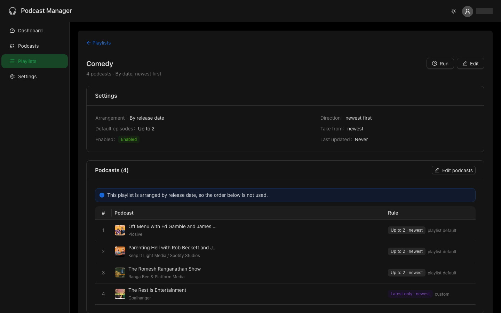
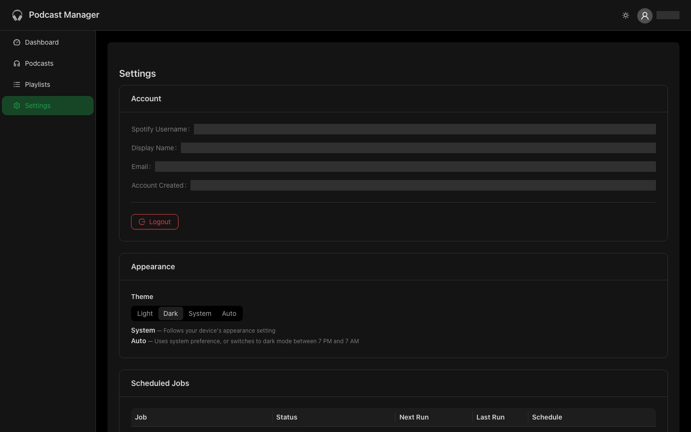

# Podcast Manager

[](https://github.com/marco308/podcast-manager/actions/workflows/ci.yml)
[](LICENSE)

Spotify puts every podcast you follow into one chronological feed. Podcast Manager is a self-hosted web app (plus an iOS companion) that splits that feed into playlists you design, such as today's news for the commute or the next unheard episode of a serial, and rebuilds the matching Spotify playlists every day.

**For a plain-English tour of what it does, see the [project page](https://marco308.github.io/podcast-manager/).** This README covers how it works and how to run it.

Podcast Manager is source-available and free for personal and other non-commercial use under the [PolyForm Noncommercial licence](#license). It is not affiliated with Spotify.

## Features

- **Managed playlists.** Assign podcasts to playlists, and the app creates and rebuilds the Spotify playlist for each one. You can also link a Spotify playlist you already own.
- **Per-assignment episode rules.** Each show in each playlist can contribute all unplayed episodes, only the latest, or up to *n*, taken from the newest or oldest end.
- **Serials in order.** Mark a story podcast as sequential and it contributes its next unfinished episode instead of its newest.
- **Two arrangements.** Keep shows grouped in a drag-and-drop order, or merge everything by release date.
- **Hands-off upkeep.** A daily job syncs your Spotify library and rebuilds every enabled playlist. Played episodes are removed every 30 minutes.
- **Library housekeeping.** Archive shows you follow but don't want to see. Shows you unfollow on Spotify stop contributing immediately and are removed after a 7-day grace period.
- **iOS companion app** for browsing, running playlists and quick edits.
- Light, dark and system themes.

## How it works

### Episode rules

What a show contributes is decided **per assignment** (podcast × playlist), so the same show can behave differently in different playlists. Every playlist carries defaults, and an assignment inherits them until you override it on the playlist's detail page. See [docs/design/assignment-rules.md](docs/design/assignment-rules.md).

| Rule | Values | Meaning |
|------|--------|---------|
| **Episodes per podcast** | all unplayed / latest only / up to *n* | How many unplayed episodes the show contributes |
| **Take from** | newest / oldest | Which end of the show's unplayed episodes to take from, and the order they play in |

Precedence: the assignment's own override, then the podcast's **Sequential** flag (forces *oldest*), then the playlist default.

For example, a Morning playlist with defaults "latest only, newest" gets today's episode of each daily news show. A story podcast marked sequential contributes its *next unfinished* episode instead, with no per-assignment setup.

### Playlist settings

- **Arrangement.** *In podcast order* concatenates each show's episodes in the order you drag them into. *By release date* merges everything by date, newest or oldest first. In a newest-first playlist, a sequential show keeps the slots it wins but fills them oldest-first, so a serial never plays out of order.
- **Enabled.** A disabled playlist is never written to on Spotify. The daily rebuild and the cleanup job skip it, and a manual run is refused. Its Spotify playlist keeps whatever it last had until you re-enable it.
- **Spotify playlist.** Leave it empty and one is created on the first run, or pick an existing playlist you own. A Spotify playlist can only be linked to one managed playlist, because each rebuild replaces its contents. Deleting a managed playlist can optionally delete the Spotify playlist too.

### Podcast states

- **Sequential.** For story podcasts that must be heard oldest to newest. Resolves every assignment's *take from* to oldest unless the assignment overrides it.
- **Archived.** Hidden from the app and dropped from all playlists, but still followed on Spotify. Unfollowing is a separate action.
- **Not on Spotify.** Set when a sync finds you've unfollowed the show. It stays visible with a tag and keeps its assignments, but contributes no episodes. If you follow it again within 7 days it returns exactly as it was; otherwise it is deleted. A sync only marks shows when it read your whole library, so a partial read can't unassign anything.

### Background jobs

| Job | Schedule | What it does |
|-----|----------|-------------|
| **Daily update** | Daily (default 04:00, changeable on the Settings page) | Syncs your Spotify library, then rebuilds every enabled playlist from unplayed episodes. A failed sync doesn't stop the rebuild. |
| **Played-episode cleanup** | Every 30 minutes | Removes fully played episodes from enabled playlists |
| **Token refresh** | Every 45 minutes | Refreshes Spotify access tokens before they expire |
| **Session cleanup** | Every hour | Removes expired login sessions |

The Settings page shows each job's next run and the result of its last one, including which step failed if part of a run did.

### Single-user by design

Each installation serves one Spotify account: registration closes once the first account signs in. To manage playlists for someone else, run a second instance for them.

## Screenshots

**Dashboard.** Library and playlist stats, with one-click sync and update.



**Podcasts.** Searchable card and table views, with inline playlist assignment, the sequential toggle, archiving and unfollowing.



**Playlists.** Every playlist with its default rule, arrangement, Spotify link and status, and one-click runs.



**Playlist detail.** A playlist's settings and the rule each show will follow on the next rebuild: the playlist default, the sequential hint, or a custom override. Editing podcasts, order and overrides starts here.



**Settings.** Spotify account, theme, and the scheduled jobs with their last-run status.



<details>
<summary>Dark theme</summary>







</details>

The images are generated by a script rather than captured by hand. With the backend and Vite dev server running:

```bash
cd frontend
npx playwright install chromium       # one-off
npm run screenshots -- --login        # one-off: complete the Spotify login in the window that opens
npm run screenshots                   # writes docs/screenshots/*.png, light and dark
```

The saved session lives in the gitignored `frontend/.screenshots-auth.json`. Account details are masked automatically. Rerun `npm run screenshots` whenever the UI changes.

## Setup

### What you need

- A Spotify **Premium** account and your own Spotify Developer application (see below)
- For deployment: a machine that runs Docker, and a public HTTPS URL for it
- For local development: Python 3.11+ (CI tests 3.11 and 3.14; the Docker image runs 3.14), Node.js, and [mkcert](https://github.com/FiloSottile/mkcert)

### Register your Spotify app

Every installation needs its **own** Spotify Developer application. There is no shared instance to point at.

1. Create an app in the [Spotify Developer Dashboard](https://developer.spotify.com/dashboard).
2. Add redirect URIs: `https://127.0.0.1:8000/api/auth/callback` for local development, plus `https://<your-api-domain>/api/auth/callback` for a deployment.
3. Copy the Client ID and Client Secret into `backend/.env`.
4. Under **User Management**, add the Spotify account that will sign in.

#### Spotify Development Mode constraints

- Since March 2026, Dev Mode needs **Spotify Premium** on the account that owns the developer app, and allows **one Dev Mode app per developer**. A lapsed Premium subscription or a second Dev Mode app can make Spotify refuse sign-in, sometimes with the unhelpful `temporarily_unavailable` error.
- Dev Mode apps are capped at **5 allowlisted users**, and extended quota is effectively unavailable to hobby projects. Podcast Manager is personal software, not something to open to the public.
- The app is built for Dev Mode's reduced API. Spotify removed the batch "Get Several X" endpoints for Dev Mode apps in early 2026, so the app uses single-item requests at low concurrency.
- Spotify OAuth rejects plain-HTTP and `localhost` redirect URIs, hence the HTTPS and `127.0.0.1` requirements below.
- Linking an existing playlist needs the `playlist-read-private` scope. If you signed in before that scope was added, sign out and back in.

### Environment variables

Copy `backend/.env.example` to `backend/.env` and fill it in:

```bash
SPOTIFY_CLIENT_ID=...
SPOTIFY_CLIENT_SECRET=...
SPOTIFY_REDIRECT_URI=https://127.0.0.1:8000/api/auth/callback   # 127.0.0.1, not localhost
ENCRYPTION_KEY=...        # python -c "from cryptography.fernet import Fernet; print(Fernet.generate_key().decode())"
FRONTEND_URL=https://127.0.0.1:3000
COOKIE_DOMAIN=            # e.g. .example.com when the API and frontend are on sibling subdomains
PLAYLIST_UPDATE_HOUR=4    # initial daily-update time; later changes made in the UI take precedence
PLAYLIST_UPDATE_MINUTE=0
```

Spotify tokens are stored encrypted with `ENCRYPTION_KEY`. Keep it stable: changing it means signing in again.

### Local development

```bash
# Backend (needs local HTTPS certs for Spotify OAuth)
cd backend
mkdir -p certs && (cd certs && mkcert -install && mkcert localhost 127.0.0.1 ::1)
python3 -m venv venv && source venv/bin/activate
pip install -r requirements-dev.txt
alembic upgrade head     # Alembic owns the schema; the app never creates tables
uvicorn app.main:app --reload \
  --ssl-keyfile=./certs/localhost+2-key.pem \
  --ssl-certfile=./certs/localhost+2.pem

# Frontend, in a second terminal
cd frontend
npm install
npm run dev              # https://127.0.0.1:3000
```

### Running tests

```bash
cd backend
pytest tests
```

No `.env` is needed; the test suite injects dummy values. CI also runs ruff, ESLint, Prettier and the frontend build (see [CONTRIBUTING.md](CONTRIBUTING.md)).

### Deployment

**Single host (Docker Compose):**

```bash
cp backend/.env.example backend/.env   # then fill in your values
docker compose up -d --build
```

The app is served on port 8080, and nginx in the frontend container proxies `/api` to the backend. Migrations run automatically when the backend container starts. Put a TLS-terminating reverse proxy (Caddy, nginx, Traefik…) in front, and set `SPOTIFY_REDIRECT_URI` and `FRONTEND_URL` to your public HTTPS URLs; Spotify OAuth won't work without them.

**Docker Swarm behind Traefik:** copy `docker-stack-traefik.example.yml` to `docker-stack-traefik.yml` (gitignored), fill in your domains and node hostnames, and deploy the stack. After that:

```bash
./deploy.sh [backend|frontend|all]
```

rolls out new images and updates the Swarm services. Set `REGISTRY=ghcr.io/<owner>` to deploy the images CI publishes to GHCR, tagged with the checked-out commit; without it, the script builds locally.

## iOS companion app

A native SwiftUI app lives in [`ios/`](ios/). It uses the same backend, and you enter the server URL on the login screen. It covers day-to-day use: browsing and syncing podcasts, marking shows sequential, adding shows to or removing them from playlists, running playlists, and viewing or changing the job schedule. Creating playlists and editing rules stays in the web app.

It isn't on the App Store, so you build it yourself with Xcode. See [ios/README.md](ios/README.md).

## Contributing

Issues and pull requests are welcome. See [CONTRIBUTING.md](CONTRIBUTING.md) and the [Code of Conduct](CODE_OF_CONDUCT.md). To report a vulnerability, follow [SECURITY.md](SECURITY.md) instead of opening a public issue.

## Support

Podcast Manager is built and maintained by [Marcus](https://marcuslab.uk/) in spare time. If it's useful to you, you can support it through [GitHub Sponsors](https://github.com/sponsors/marco308) or [Buy Me a Coffee](https://buymeacoffee.com/marcuslab).

<p align="center"><a href="https://github.com/sponsors/marco308"></a> <a href="https://buymeacoffee.com/marcuslab"></a></p>

## License

[PolyForm Noncommercial 1.0.0](LICENSE). You're free to use, modify and self-host Podcast Manager for personal and other non-commercial purposes. **Commercial use is not permitted.** To use it commercially, get in touch about a separate licence. Contributions are accepted under the same licence (see [CONTRIBUTING.md](CONTRIBUTING.md)).

Spotify is a trademark of Spotify AB. This project is not affiliated with or endorsed by Spotify.
